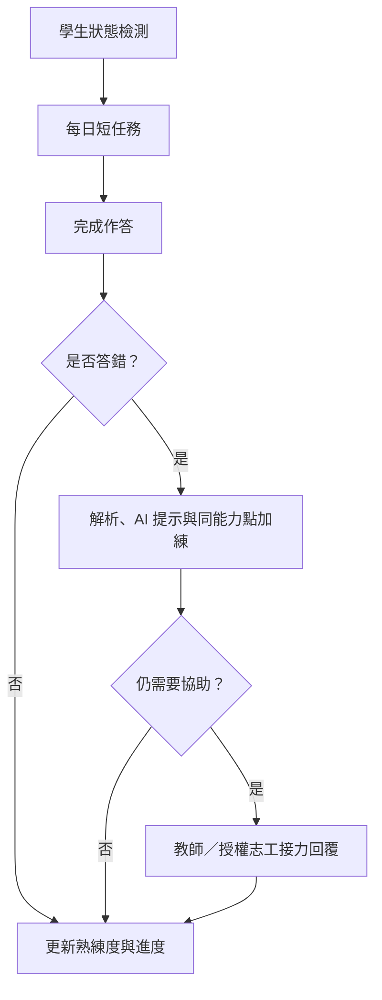
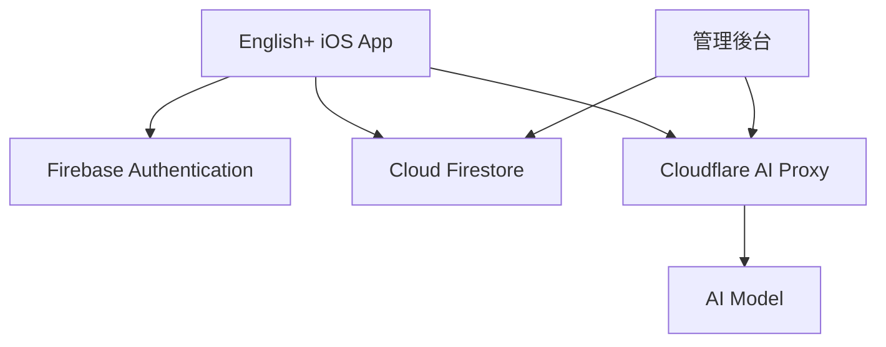

# English+

> AI 即時支持 × 真人接力陪伴的英文學習平台  
> 讓每一次卡住，都有清楚的下一步。

**入選 2026 AI 公益創新競賽決賽｜Demo Day：2026 年 11 月 14 日**

English+ is an AI-assisted English learning platform designed to prevent students from dropping out of the learning process after making a mistake. It combines structured practice, post-answer AI guidance, and permission-based human support from teachers and qualified volunteers.

---

## 專案簡介

English+ 從偏鄉與教育資源落差的田野調查出發，聚焦一個經常被忽略的問題：

**學生真正缺少的，不一定是更多題目，而是答錯、卡關之後仍能繼續前進的支持路徑。**

學生先透過簡短的狀態檢測，說明今天的心情、可用時間、挑戰意願與想練習的題型。系統結合近期作答紀錄，由 AI 提出任務建議，再從結構化題庫中選出真實且可驗證的題目。

當學生答錯時，English+ 不會在作答前直接提供答案，而是在送出答案後依序提供：

1. 正確答案與原始解析
2. AI 觀念提示
3. 同能力點加練
4. 必要時轉交教師或經審核、取得班級授權的志工

教師與志工收到的不只是一句「我不會」，而是包含題目、學生答案、正確答案、能力點與既有解析的完整脈絡。

---

## 核心學習閉環



English+ 的目標不是讓學生單次做最多題，而是讓學生：

- 願意開始
- 知道自己正在做什麼
- 答錯後不會立刻離開
- 需要時能取得下一層支持
- 將回覆與練習結果保留在同一條學習路徑中

---

## 目前完成內容

### 學生端

- 四題狀態檢測
- AI 每日任務建議
- 結構化題庫練習
- 自由練習與班級任務
- 答錯後解析與 AI 觀念提示
- 同能力點加練
- 錯題與熟練度紀錄
- 主動建立真人支持請求
- 查看教師與志工回覆
- 個人資料匯出與刪除流程

### 教師端

- 建立與管理班級
- 指派班級任務
- 查看學生逐題進度
- 接收包含完整題目脈絡的求助
- 回覆學生並管理支持討論
- 審核及管理班級志工
- 查看學習與 Pilot 相關資料

### 志工端

- 提交資格與服務申請
- 經管理者審核後取得服務資格
- 經教師授權後加入指定班級
- 僅查看獲授權班級中的主動求助
- 使用及修改 AI 回覆草稿
- 回覆學生並保留服務紀錄

---

## 題庫與 AI 設計

English+ 目前包含：

- **1,080 題**原創結構化英文題目
- **A1–B2** 難度範圍
- **7 類**主要題型
- **36 個**英文能力點
- 題型、難度、能力點與答案等結構化欄位

AI 不直接任意生成題目。每日任務中的實際題目由系統從既有題庫選取，AI 主要負責：

- 任務條件建議
- 錯題觀念說明
- 學習方向摘要
- 教師回覆草稿
- 志工回覆輔助

學生送出答案前不會看到 AI 解題入口，以降低直接取得答案與依賴生成式 AI 的風險。

---

## 技術架構

| 層級 | 技術與用途 |
|---|---|
| iOS App | Swift、SwiftUI |
| 身分驗證 | Firebase Authentication |
| 雲端資料 | Cloud Firestore |
| AI 後端 | Cloudflare Worker AI Proxy |
| 管理工具 | Web-based administrator review portal |
| 題庫 | Bundled structured JSON seed data |
| 測試 | XCTest、XCUITest、Firebase Emulator、GitHub Actions |
| 舊版原型 | Kotlin／Android classroom prototype |

正式 AI 金鑰不儲存在 App 中。App 先取得使用者身分憑證，再透過後端代理進行驗證、限流、格式檢查與 AI 請求。



---

## 權限與資料治理

English+ 採用學生、教師、志工三種角色，並以班級和授權範圍限制資料存取。

- 學生只能查看自己的學習資料與支持討論
- 教師只能管理自己的班級與班級成員
- 志工通過資格審核後，仍須取得特定班級授權
- 志工不能查看學生完整私人紀錄或其他班級資料
- 學生可撤回、收起、檢舉或封鎖不適當的支持回覆
- 情緒狀態只用於調整學習節奏，不作醫療推論
- Pilot 與研究資料採去識別化統計

若正式 Pilot 涉及未成年人，將先取得必要的學校、參與者及法定代理人同意。

---

## 目前產品狀態

| 項目 | 狀態 |
|---|---|
| SwiftUI iOS App | 已完成主要學生、教師與志工流程 |
| 結構化題庫 | 已完成 1,080 題與能力點標記 |
| Firebase Auth／Firestore | 已完成整合與角色化資料流程 |
| AI 安全代理 | 已完成 Cloudflare Worker 路徑 |
| 跨裝置真人接力 | 已完成主要流程 |
| TestFlight／實機驗證 | 已完成既有版本測試流程 |
| 自動化測試 | 已建立單元、整合與關鍵 UI 測試 |
| 決賽版本驗證 | 準備重新執行完整 build、test 與實機 smoke test |
| 校內 Micro Pilot | 準備執行，尚未宣稱成效 |
| 公開正式上線 | 尚未開放 |

> English+ 目前是可進行實機展示與小規模驗證的產品版本，不將預定 Pilot 指標描述為既有成果，也不將目前狀態宣稱為已完成大規模正式部署。

---

## Demo Day 前驗證

決賽現場將聚焦展示以下完整閉環：

1. 學生完成狀態檢測
2. 系統建立每日短任務
3. 學生答錯並取得原始解析
4. AI 提供觀念提示
5. 學生送出真人支持請求
6. 教師於另一台裝置收到完整題目脈絡
7. 教師回覆並同步至學生端
8. 學生完成同能力點加練

決賽前亦將執行校內 Micro Pilot，主要驗證：

- 每日任務啟動與完成情形
- 答錯後是否繼續解析、加練或求助
- 同能力點錯題修復
- 真人求助回覆時間
- 學生對清楚度、壓力與掌控感的評價

---

## Repository 結構

```text
English-PLUS/
├── ios/EnglishPlus/              # Native SwiftUI iOS project
├── app/                          # Earlier Android classroom prototype
├── workers/englishplus-ai-proxy/ # Cloudflare AI proxy
├── admin-web/                    # Administrator review portal
├── firebase-tests/               # Firestore rules and lifecycle tests
├── functions/                    # Backend functions
├── scripts/                      # Validation and release checks
└── docs/                         # Product, privacy, QA and deployment notes
```

---

## 本機建置

### 環境需求

- macOS
- Xcode
- 可執行 iOS Simulator 的開發環境
- 已設定的 Firebase iOS 專案
- 本機提供的 `GoogleService-Info.plist`

請勿將正式 Firebase 設定、AI 金鑰或其他敏感憑證提交至 GitHub。

### 開啟專案

```bash
open ios/EnglishPlus/EnglishPlus.xcodeproj
```

一般開發與測試使用：

```text
Scheme: EnglishPlus
```

競賽版本封存使用：

```text
Scheme: EnglishPlusCompetition
Build Configuration: Competition
```

### Simulator Build

```bash
xcodebuild \
  -project ios/EnglishPlus/EnglishPlus.xcodeproj \
  -scheme EnglishPlus \
  -configuration Debug \
  -sdk iphonesimulator \
  -destination 'generic/platform=iOS Simulator' \
  CODE_SIGNING_ALLOWED=NO \
  clean build-for-testing
```

完整 CI 亦會驗證：

- Cloudflare AI gateway
- 管理後台
- Firestore Rules 與班級生命週期
- Swift 單元及整合測試
- 學生、教師、志工關鍵 UI 流程
- Dark Mode 與 Dynamic Type 顯示

---

## 專案里程碑

- 完成問題調查與教育場域需求整理
- 完成 Android 課堂原型
- 完成原生 SwiftUI iOS 版本
- 完成學生、教師與志工三角色流程
- 完成 Firebase、AI Proxy 與管理後台整合
- 完成 TestFlight 與實機驗證流程
- 入選 2026 AI 公益創新競賽決賽
- 執行校內 Micro Pilot
- 2026 年 11 月 14 日參與決賽 Demo Day

---

## 開發者

### 陳品睿 Ray Chen

English+ 專案負責人、產品設計與全端開發者。

獨立負責：

- 偏鄉英文學習問題調查與產品定位
- 學生、教師與志工三角色使用流程設計
- Android 課堂原型與原生 SwiftUI iOS App 開發
- 1,080 題結構化英文題庫與學習引擎
- AI 任務建議、錯題提示與真人接力機制
- Firebase Authentication、Cloud Firestore 與跨裝置同步
- Cloudflare AI Proxy 與管理後台
- 使用者權限、隱私與資料治理設計
- 自動化測試、實機驗證與 TestFlight 發布流程
- 競賽提案、決賽簡報、實機 Demo 與 Pilot Run 規劃

---

## 聯絡方式

Email：englishplus.tw@gmail.com

---

**English+｜讓每一次卡住，都有清楚的下一步。**
