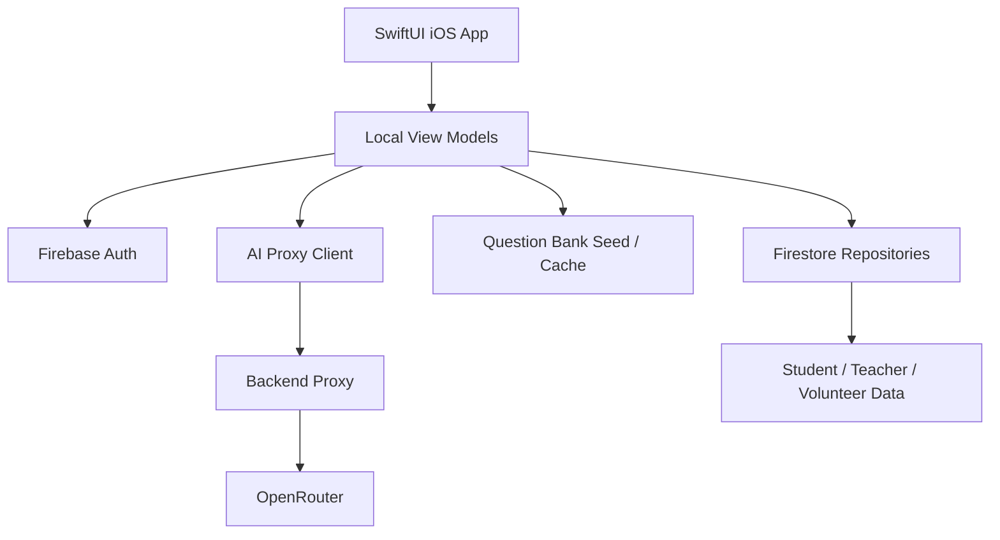

# English+ iOS / TestFlight Migration Master Spec

Last updated: 2026-06-10  
Round: 1 of 8  
Status: Windows-side migration planning artifact  
Source app: English+ Android prototype `0.7.0`

## 1. Purpose

English+ is currently a native Android prototype for a rural English learning support platform. The new target is to prepare a native iOS version that can be tested through TestFlight.

This round does not rewrite the app into iOS yet. It creates the master migration specification so the Mac / Xcode phase can start from a stable plan instead of rediscovering product decisions from the Android codebase.

The goal is:

- Preserve the product logic that already works in the Android prototype.
- Translate the student, teacher, and volunteer experience into a SwiftUI-ready structure.
- Prepare Firebase, AI proxy, question-bank, privacy, and TestFlight decisions before Xcode work begins.
- Keep the Android prototype as the reference implementation until the iOS app is running.

## 2. Fixed Decisions

| Area | Decision |
| --- | --- |
| iOS approach | Native SwiftUI app |
| Mac availability | User has access to a Mac for Xcode work |
| Apple Developer route | Personal Apple Developer account |
| TestFlight testers | Students, teachers, and volunteers will all be included |
| Login | Firebase Email/Password plus test accounts first |
| Cloud database | Firebase Firestore |
| AI | OpenRouter via backend proxy; no production key stored in the app |
| Question bank | Reuse the current Android question bank as the source |
| Student data | Real student data may be used, so consent and privacy handling are required |
| Brand | Keep current English+ visual identity and product language |
| First iOS scope | Full student, teacher, and volunteer tracks |
| Windows-side work | Finish all possible planning, specs, and data handoff before moving to Xcode |

## 3. Current Android Reference State

The Android prototype already contains the following product capabilities:

- Role-separated student, teacher, and volunteer tracks.
- Student mood/time check-in before guided daily missions.
- Daily mission progress that counts correctly answered assigned questions only.
- Free practice and a large English question bank with varied question types and difficulty.
- Answer feedback, repair hints, and student-facing success states.
- Support request flow for learning or emotional breakpoints.
- Teacher/volunteer handoff board and action queues.
- Student roster and student-detail views.
- SQLite-backed local persistence.
- Firebase-ready auth and cloud scaffolding.
- OpenRouter-ready AI boundaries with local fallback language.
- Report, privacy, QA, and release-readiness documents.

The iOS project should not blindly copy Android UI files. It should copy the product intent, data contracts, user flows, and mature decisions, then rebuild the interface in SwiftUI.

## 4. Target iOS / TestFlight Scope

The first TestFlight-ready iOS prototype should include three complete role tracks.

### Student Track

The student track should feel sequential and low-pressure:

1. Choose role or login as student.
2. Complete a short check-in.
3. Receive today's recommended mission.
4. Practice assigned questions with a clear mission progress bar.
5. See immediate correctness feedback and repair explanation.
6. Finish today's mission with an explicit completion moment.
7. Continue optional free practice without confusing it with the daily mission.
8. Ask for support when stuck, and see teacher/volunteer replies in a student-facing way.

### Teacher Track

The teacher track should focus on triage and feedback:

1. Login as teacher.
2. See today’s class priority.
3. Review students who need attention.
4. Open a student detail page.
5. Read learning status, help request, and recent progress.
6. Send a concrete reply or assign next action.
7. Review class reports and sync status.

### Volunteer Track

The volunteer track should support lightweight companionship:

1. Login as volunteer.
2. See assigned students or pending support items.
3. Read the student’s current difficulty in plain language.
4. Send encouragement, hints, or escalation notes.
5. Avoid teacher-only diagnostics unless needed for handoff.

## 5. Target Architecture

### iOS App Layer

- SwiftUI screens and components.
- View models for student, teacher, and volunteer flows.
- Local state for current session, check-in answers, mission progress, and offline display.
- User-facing copy only; no setup/debug language on normal screens.

### Firebase Layer

- Firebase Auth for email/password test accounts.
- Firestore for user profiles, role membership, class data, missions, support requests, replies, and reports.
- Security rules must be role-scoped before any real student data is used.

### AI Proxy Layer

- The app calls a backend endpoint, not OpenRouter directly.
- The backend stores the OpenRouter key.
- The proxy returns structured responses for:
  - daily mission recommendation,
  - answer explanation,
  - support phrasing,
  - teacher/volunteer summary suggestions.
- If the proxy is unavailable, the app should show a graceful fallback, not technical setup text.

### Question Bank Layer

- Android question bank is the source of truth for the first iOS seed.
- iOS should consume a structured format such as JSON, SQLite seed, or Firestore seed.
- Each question must preserve:
  - id,
  - prompt,
  - options or expected answers,
  - correct answer,
  - explanation,
  - difficulty,
  - skill,
  - unit/topic,
  - question type,
  - source/license note.

## 6. Windows-Side Work Boundaries

These eight rounds can be completed on this Windows machine:

- Migration master spec.
- SwiftUI screen map and user-flow mapping.
- Data-format and question-bank conversion specification.
- Firebase Auth / Firestore schema plan.
- OpenRouter backend proxy requirements.
- Real-student-data privacy checklist.
- TestFlight preparation checklist.
- Xcode handoff document.

These cannot be fully completed on this Windows machine:

- Compile and run a real iOS app.
- Verify SwiftUI screens in iOS Simulator.
- Sign with Apple Developer certificates.
- Upload to TestFlight.
- Generate or validate final `GoogleService-Info.plist` inside Xcode.

## 7. Migration Rounds

| Round | Output | User data needed before the round |
| --- | --- | --- |
| 1 | Migration master spec and folder entry point | None |
| 2 | SwiftUI screen map for student, teacher, volunteer | None unless the user wants a new visual direction |
| 3 | Android-to-iOS data format spec for questions, roles, missions, support | None |
| 4 | Firebase Auth / Firestore schema and security-rule draft | Firebase project name and final Bundle ID if already decided |
| 5 | OpenRouter backend proxy contract | Backend choice: Firebase Cloud Functions, Cloudflare Workers, or school/custom backend |
| 6 | Privacy and real-student-data usage checklist | Data fields, consent status, who can see emotional/support data |
| 7 | TestFlight preparation checklist | Apple Developer status, tester emails, app icon, privacy policy URL |
| 8 | Xcode handoff document | Xcode availability, Apple login, Firebase plist, final Bundle ID |

## 8. Risk Register

| Risk | Why it matters | Control |
| --- | --- | --- |
| Android code cannot be reused directly | Native Android Kotlin UI cannot become SwiftUI automatically | Treat Android as reference, not source-to-source migration |
| Real student data | Mood, support, and learning data are sensitive | Require consent, role-based access, retention rules, and privacy policy |
| API key exposure | Putting OpenRouter key in iOS app would leak it | Use backend proxy only |
| TestFlight signing | Apple signing must happen on Mac/Xcode | Prepare docs now, perform signing later |
| Question-bank licensing | Public exam or web-sourced material may have reuse limits | Track source/license field and replace uncertain items before public use |
| Overcrowded UI | Android history showed too many functions on one screen | Preserve sequential flows and role separation in SwiftUI map |

## 9. Quality Gate For iOS Work

Before the iOS app is considered ready for TestFlight, it should pass these checks:

- Student can complete check-in, receive a mission, answer assigned questions, and see a mission-complete state.
- Student can enter free practice without corrupting daily mission progress.
- Student can ask for support and later see a teacher or volunteer response.
- Teacher can find the highest-priority student and send a meaningful reply.
- Volunteer can handle assigned support items without seeing unnecessary teacher-only information.
- Login prevents cross-role access.
- Firestore rules block unauthorized reads/writes.
- OpenRouter key is never present in the iOS app bundle.
- App works with unavailable network using clear user-facing fallback states.
- No setup, debug, or internal implementation text appears on normal user screens.

## 10. Mac Continuation Plan

When moving to the Mac:

1. Clone or pull the latest GitHub repository.
2. Open the iOS/TestFlight docs folder first.
3. Create a new SwiftUI iOS app in Xcode.
4. Use the screen map from Round 2 as the navigation structure.
5. Add Firebase using the schema and setup notes from Round 4.
6. Add the question-bank seed according to Round 3.
7. Connect the AI proxy according to Round 5.
8. Run the app in iOS Simulator.
9. Create TestFlight build only after privacy, signing, and tester setup are ready.

## 11. Self-Review

- No unresolved placeholder items remain in this document.
- The plan reflects the user-selected decisions.
- Android Studio is not treated as the iOS build tool.
- GitHub is treated as the bridge between Windows preparation and Mac/Xcode implementation.
- Real student data and AI key risks are explicitly separated from normal UI design work.
