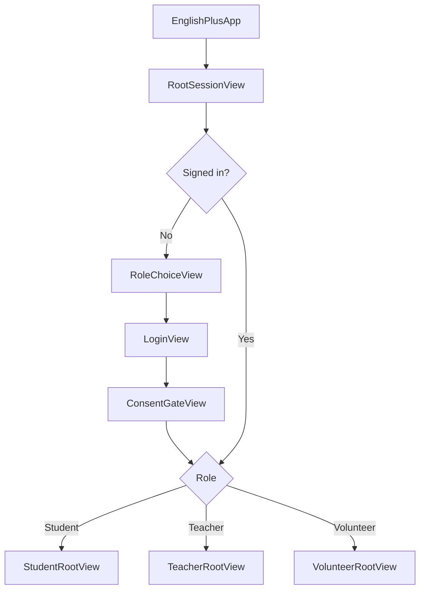
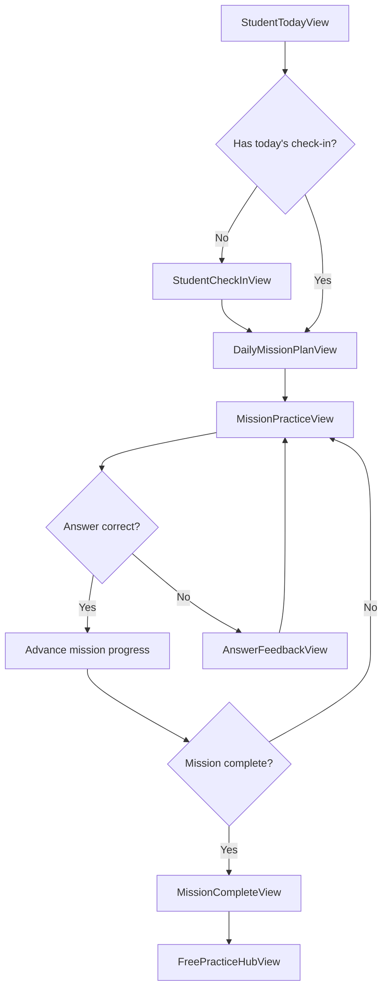
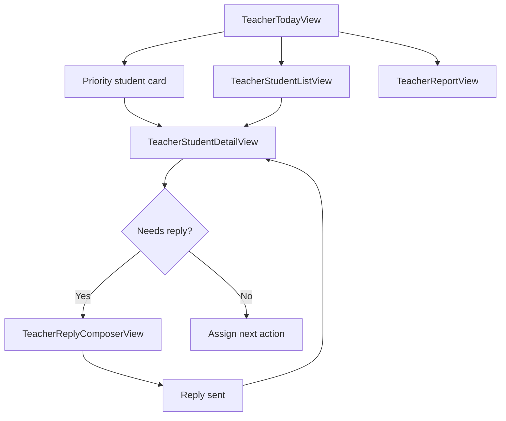
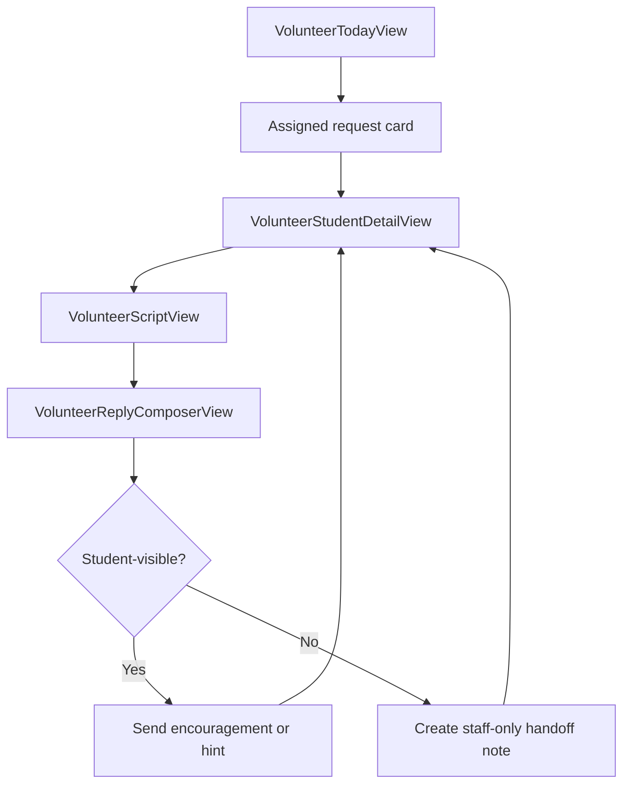

# English+ SwiftUI Screen Map And User Flow

Last updated: 2026-06-10  
Round: 2 of 8  
Status: Windows-side iOS design handoff  
Depends on: `round-1-migration-master-spec.md`

## 1. Design Goal

The iOS app should not feel like a menu of prototype features. It should feel like a guided learning companion:

- Role first: student, teacher, and volunteer experiences must separate before the main app appears.
- One primary action per screen: each screen should make the next useful step obvious.
- Student flow stays sequential: check in, receive a daily mission, practice, get feedback, complete, then optionally continue.
- Free practice stays available, but it must not be confused with the daily mission.
- Teacher and volunteer tracks focus on triage, reply, and handoff instead of showing student-only learning maps.
- Internal setup text, API status details, debug wording, and implementation language must not appear in normal user screens.

The interaction standard is close to a mature learning app: clear route, persistent progress, immediate feedback, and a satisfying completion moment.

## 2. App-Level Navigation

Use one root session gate, then route into exactly one role shell.



### Root Rules

- `RootSessionView` owns authentication state and role routing.
- `RoleChoiceView` should ask only: "今天你要用哪一端？" with three clear choices.
- `LoginView` should show user-facing account fields only. Do not mention Firebase on normal screens.
- `ConsentGateView` appears only when real student data consent is required or missing.
- After role routing, the app should not show other roles' navigation tabs.

## 3. Proposed SwiftUI File Map

```text
EnglishPlusIOS/
  App/
    EnglishPlusApp.swift
    RootSessionView.swift
    AppRoute.swift
    AppTheme.swift
  Auth/
    RoleChoiceView.swift
    LoginView.swift
    ConsentGateView.swift
    SessionViewModel.swift
  Shared/
    Components/
      PrimaryButton.swift
      SecondaryButton.swift
      ProgressPill.swift
      MissionProgressBar.swift
      StatusCard.swift
      EmptyStateView.swift
      ErrorStateView.swift
      LoadingStateView.swift
    Models/
      UserRole.swift
      MissionModels.swift
      QuestionModels.swift
      SupportModels.swift
      StaffModels.swift
  Student/
    StudentRootView.swift
    StudentTodayView.swift
    StudentCheckInView.swift
    DailyMissionPlanView.swift
    MissionPracticeView.swift
    AnswerFeedbackView.swift
    MissionCompleteView.swift
    FreePracticeHubView.swift
    PracticeSessionView.swift
    SupportHomeView.swift
    SupportThreadView.swift
    LearningMapView.swift
    StudentProfileView.swift
    StudentFlowViewModel.swift
  Teacher/
    TeacherRootView.swift
    TeacherTodayView.swift
    TeacherStudentListView.swift
    TeacherStudentDetailView.swift
    TeacherReplyComposerView.swift
    TeacherReportView.swift
    TeacherSyncView.swift
    TeacherWorkspaceViewModel.swift
  Volunteer/
    VolunteerRootView.swift
    VolunteerTodayView.swift
    VolunteerAssignmentListView.swift
    VolunteerStudentDetailView.swift
    VolunteerReplyComposerView.swift
    VolunteerScriptView.swift
    VolunteerSyncView.swift
    VolunteerWorkspaceViewModel.swift
  Services/
    AuthService.swift
    FirestoreService.swift
    QuestionBankService.swift
    MissionPlannerService.swift
    AIProxyService.swift
    SupportService.swift
```

## 4. Student Screen Map

Student tabs should stay stable after login:

| Tab | SwiftUI root | Purpose |
| --- | --- | --- |
| Today / 今日 | `StudentTodayView` | Check-in status, daily mission, mission completion |
| Practice / 練習 | `FreePracticeHubView` | Free practice by level, type, unit, and challenge |
| Support / 支持 | `SupportHomeView` | Ask for help and read replies |
| Map / 地圖 | `LearningMapView` | Learning progress and next milestones |
| Profile / 我的 | `StudentProfileView` | Account, streak, privacy, local settings |

### Student Happy Path



### Student Check-In

`StudentCheckInView` should be a short wizard or compact form with at most four questions:

1. 今天的心情量表, 1 to 5.
2. 今天有足夠的時間練習英文嗎, 1 to 5.
3. 今天會想要挑戰更難的題目嗎, 想 / 不想.
4. 想要多練習哪幾種題型, multi-select:
   - 選擇題
   - 填空題
   - 克漏字
   - 閱讀理解
   - 翻譯/句子重組

The check-in result should generate:

- route label, such as "低壓修復", "穩定練習", or "挑戰暖身";
- daily question goal;
- recommended question types;
- friendly reason in student language;
- no repeated later time selection.

### Student Daily Mission Plan

`DailyMissionPlanView` should show:

- today's route;
- question goal, for example "完成 3 題";
- recommended types;
- one primary button: "開始今日任務";
- a secondary route to free practice.

It should not show raw AI confidence, model names, backend status, route codes, or internal state.

### Student Mission Practice

`MissionPracticeView` owns the daily mission progress bar.

Progress rules:

- Show progress only during assigned daily mission questions.
- Count only correct answers.
- Wrong answers do not advance progress.
- Free practice never changes daily mission progress.
- Progress label should use clear count copy, such as "今日任務 1/3".
- When the goal is reached, immediately move to `MissionCompleteView`.

Recommended layout:

1. Top compact mission progress bar.
2. Question type and difficulty pill.
3. Prompt.
4. Answer input/options.
5. Sticky bottom primary action.
6. Feedback state after submit.

### Student Answer Feedback

`AnswerFeedbackView` should be local to the question flow.

- Correct: show a clear success state and continue action.
- Incorrect: show why the selected answer is wrong, the correct answer, and one repair hint.
- Do not route automatically into support after repeated wrong answers.
- Offer support as a calm secondary action: "我想請人幫我看".

### Student Mission Complete

`MissionCompleteView` is the student's peak moment.

It should show:

- clear title: "今日任務完成";
- progress summary, for example "你完成了 3/3 題";
- short encouragement;
- primary action: "繼續自由練習";
- secondary action: "回到今日".

This completion state is required before TestFlight because it solves the previous confusion about whether the student had finished the daily task.

### Student Free Practice

`FreePracticeHubView` lets students choose:

- difficulty: 入門, 基礎, 會考核心, 挑戰;
- question type;
- unit/topic;
- short session length by question count.

Free practice should not require check-in, and it should not push the student back to check-in unexpectedly. If the student has not checked in, show a small suggestion card, not a blocking wall.

### Student Support

`SupportHomeView` should be simple:

- "我想請人幫我看" for human support.
- "先看提示" for AI/built-in repair support.
- "查看回覆" for existing teacher/volunteer replies.

Support should not look like a staff dashboard. Student-visible support text should focus on what the student can do next.

## 5. Teacher Screen Map

Teacher tabs:

| Tab | SwiftUI root | Purpose |
| --- | --- | --- |
| Today / 今日 | `TeacherTodayView` | Highest-priority student and pending work |
| Students / 學生 | `TeacherStudentListView` | Roster, risk, progress, help status |
| Handoff / 接力 | `TeacherStudentDetailView` or queue view | Open help requests and replies |
| Reports / 報告 | `TeacherReportView` | Class summary and export-ready reports |
| Sync / 同步 | `TeacherSyncView` | Data update status and offline queue |

### Teacher Flow



### Teacher Today

Primary message: "今天先接住誰？"

Show only:

- highest-priority student;
- number of high-risk students;
- pending help count;
- one primary action: "查看第一優先學生";
- secondary actions for roster and reports.

Do not show duplicate bottom navigation, raw sync payloads, AI setup, or student-only learning maps.

### Teacher Student Detail

`TeacherStudentDetailView` should show:

- student name and class;
- daily mission status;
- recent wrong-answer patterns;
- open help request, if any;
- teacher-visible history;
- primary action: reply or assign next task.

Teacher should be able to write their own response. The app may suggest wording, but the teacher must be able to edit before sending.

### Teacher Reply Composer

`TeacherReplyComposerView` should include:

- student context summary;
- editable reply field;
- suggested reply chips;
- visibility choice:
  - send to student;
  - staff-only note;
- send button.

The default must be student-visible only when the wording is safe for the student to read.

## 6. Volunteer Screen Map

Volunteer tabs:

| Tab | SwiftUI root | Purpose |
| --- | --- | --- |
| Today / 今日 | `VolunteerTodayView` | Assigned support items |
| Students / 學生 | `VolunteerAssignmentListView` | Assigned students only |
| Scripts / 陪伴 | `VolunteerScriptView` | Conversation prompts and support language |
| Sync / 同步 | `VolunteerSyncView` | Data update state |
| Profile / 我的 | Volunteer profile/settings | Account and boundaries |

### Volunteer Flow



### Volunteer Boundaries

Volunteers should see:

- assigned support items;
- student-facing difficulty summary;
- safe context for companionship;
- suggested wording;
- reply composer;
- escalation option to teacher.

Volunteers should not see:

- full class analytics;
- raw emotional-data history beyond the active support context;
- teacher-only reports;
- question-bank management tools.

## 7. Shared Components

| Component | Use |
| --- | --- |
| `PrimaryButton` | Main action in thumb zone |
| `SecondaryButton` | Low-pressure alternate action |
| `MissionProgressBar` | Daily mission only |
| `ProgressPill` | Compact counts, such as streak or question progress |
| `StatusCard` | One concise state with one action |
| `StudentCard` | Staff roster and priority lists |
| `ReplyComposer` | Teacher and volunteer replies |
| `QuestionCard` | Practice prompt and metadata |
| `AnswerFeedbackPanel` | Correct/incorrect response |
| `EmptyStateView` | No mission, no assigned students, no replies |
| `ErrorStateView` | Network or auth failures |

## 8. Visual And Interaction Rules

- Baseline device width: 375 pt.
- Tap targets: at least 44 x 44 pt.
- Use one primary brand color, restrained accent colors, and clear contrast.
- Cards should contain one decision or one status, not several unrelated modules.
- Bottom tabs must be fixed and appear only once.
- Avoid nested cards.
- Do not use screen-level text explaining app architecture.
- Do not show AI key, OpenRouter model, Firebase, route codes, or debug status on normal screens.
- Use clear Traditional Chinese labels:
  - 今日
  - 練習
  - 支持
  - 地圖
  - 我的
  - 學生
  - 接力
  - 報告
  - 同步

## 9. State And Routing Rules

### Student

- `hasCompletedTodayCheckIn` controls whether the daily mission can be generated.
- Practice center remains available even without check-in.
- Support remains available even without check-in.
- Daily mission progress exists only when `activeMissionSession.isDailyMission == true`.
- `dailyMissionDone` increases only after correct answers.
- `dailyMissionComplete` routes to completion screen.

### Teacher

- Teacher home always starts from the highest-priority unresolved item.
- Student detail is the center of reply and assignment decisions.
- Reports are summary views, not the default first action.
- Sync information should use user-facing language such as "資料已更新" or "尚有資料待補傳".

### Volunteer

- Volunteer home always starts from assigned or pending support items.
- Staff-only notes must not appear in the student's support thread.
- Volunteer replies should be student-safe by default.
- Escalation to teacher should be explicit and simple.

## 10. Loading, Empty, Error, And Offline States

| State | Student | Teacher | Volunteer |
| --- | --- | --- | --- |
| Loading | "正在準備今天的任務" | "正在整理班級狀態" | "正在整理接力項目" |
| Empty | "今天還沒有任務，先做心情檢測或自由練習" | "目前沒有需要立即處理的學生" | "目前沒有分派給你的接力項目" |
| Offline | "目前離線，先使用已下載題目" | "目前離線，回覆會稍後送出" | "目前離線，接力紀錄會稍後送出" |
| Error | "剛剛沒有成功，請再試一次" | "資料暫時讀不到，請稍後重試" | "接力資料暫時讀不到，請稍後重試" |

Never show stack traces, provider names, API route names, or setup instructions in these states.

## 11. First Xcode Build Order

When the Mac phase begins, build screens in this order:

1. `AppTheme` and shared components.
2. `RootSessionView`, `RoleChoiceView`, and `LoginView`.
3. `StudentRootView` and the student tab shell.
4. Student check-in, daily mission plan, mission practice, feedback, and completion.
5. Free practice hub and question session.
6. Student support home and support thread.
7. Teacher root, today, roster, student detail, and reply composer.
8. Volunteer root, today, assigned detail, script, and reply composer.
9. Reports, sync, profile, and secondary settings.
10. Firebase and AI proxy integration.

This order lets the iOS app become usable quickly while still preserving the full three-role scope.

## 12. Round 2 Self-Review

- The screen map separates student, teacher, and volunteer before the main app.
- Student daily mission progress is limited to daily mission questions only.
- Free practice and support remain accessible without forcing check-in.
- Teacher and volunteer tracks do not reuse student-only learning map screens.
- Staff reply flows allow editable human replies.
- Debug/setup/internal provider language is banned from normal screens.
- The file map is concrete enough for a SwiftUI project to begin on Mac.
